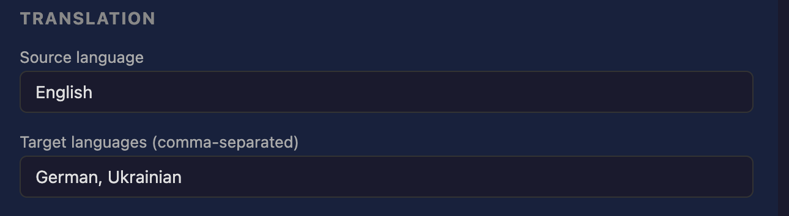
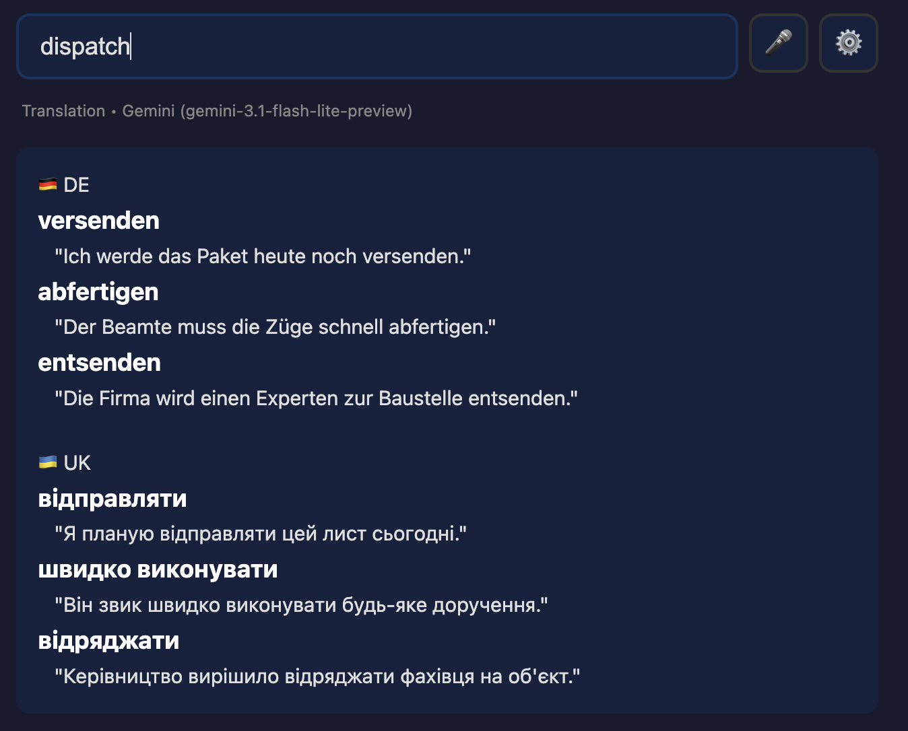
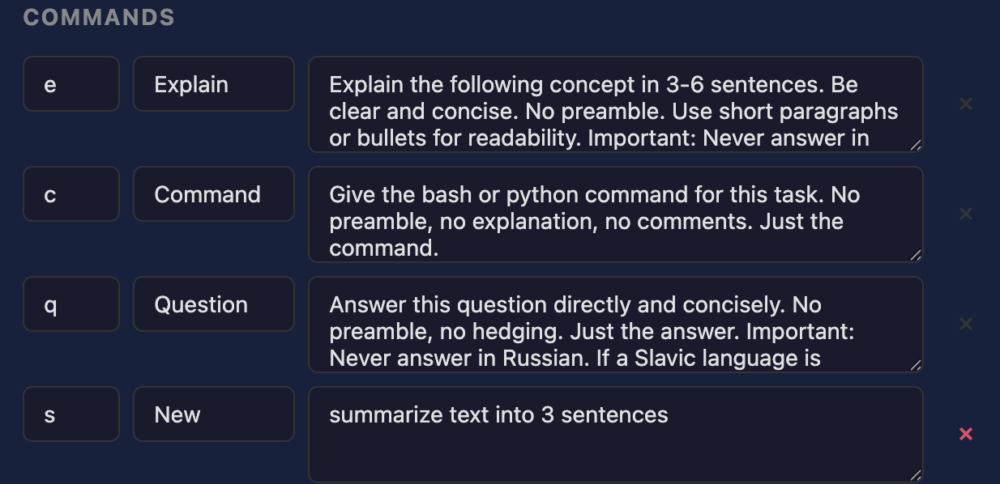

# Trivi — крихітний застосунок для швидких питань

## Що робить Trivi

Trivi — це маленький застосунок, який живе у вас на телефоні чи ноутбуці. Один клік — і він відкритий. Ви вводите слово чи текст і одразу отримуєте відповідь:

1. Перекладає слово на всі ваші мови — одразу.
2. Пояснює поняття, фразу або тему в 3–6 коротких реченнях.
3. Відповідає на швидке запитання — лише відповідь, без води.

Ви також можете додавати власні команди (повернемось до цього нижче).

---

## Як працює Trivi

Trivi працює повністю всередині вашого браузера. Жодного сервера Trivi не існує. Коли ви щось запитуєте, ваш браузер напряму звертається до AI-провайдера — Google Gemini або OpenAI — використовуючи **ваш власний ключ**. Відповідь приходить прямо у ваш браузер.

З цього випливає три речі:

- **Ваші дані залишаються тільки у вас.** Ніхто (включно з нами) не може прочитати ваші запити чи відповіді. Вони не проходять через жоден наш сервер, бо ми його не маємо.
- **Ви використовуєте власний AI-ключ.** Один раз отримуєте безкоштовний ключ у Google (Gemini), вставляєте в Trivi — і все. За бажанням можете додати ключ OpenAI як запасний варіант.
- **Ви нічого не платите нам.** Сам Trivi безкоштовний у користуванні. У AI-провайдера є власний безкоштовний ліміт — звичайного користування він покриває.

Зворотний бік: оскільки все живе у браузері, **очищення даних браузера стирає налаштування Trivi** (включно з ключами та власними командами). Тому в Trivi є кнопка **Export config** — про неї нижче, у розділі «Резервна копія».

Trivi підтримує тільки двох провайдерів — **Gemini та OpenAI**. Інших клієнтів немає.

---

## Крок 1 — Отримайте безкоштовний ключ Google

Trivi не має власного сервера — він звертається до AI від Google прямо з вашого браузера. Для цього Google видає вам безкоштовний **ключ** (Google називає його «API key»). Уявіть читацький квиток у бібліотеці: Google його видає, він нічого не коштує, банківська картка не потрібна, і він лише повідомляє Google, чий безкоштовний ліміт використовувати. Ключ зберігається тільки на вашому пристрої — ніхто інший (включно з нами) його не бачить.

Trivi проведе вас через це сам. Відкрийте Trivi, натисніть червоний привітальний банер (або значок шестерні) — і побачите три кроки:

1. Натисніть **Open Google's key page**. Якщо попросять — увійдіть будь-яким Google-акаунтом.
2. На сторінці Google натисніть **Create API key** і скопіюйте ключ. Це довгий рядок, який починається з `AIza`.
3. Поверніться в Trivi, вставте ключ у поле **Paste your key here** і натисніть **Test & save**.

---

## Крок 2 — Перевірте, що все працює

Після **Test & save** Trivi запитує Google, чи ключ справний, і каже вам простими словами:

- **Connected ✓** — готово. Тепер Trivi використовує цей ключ кожного разу, коли ви щось запитуєте.
- **Google doesn't recognise this key** — поверніться на сторінку Google і скопіюйте ключ ще раз повністю (значок ока показує, що саме ви вставили).
- **Couldn't reach Google** — перевірте інтернет і натисніть **Test & save** ще раз.

Ось і все налаштування.

Варто знати: ключ живе лише в цьому браузері. Будь-хто, хто користується цим профілем браузера, зможе користуватися Trivi з вашим ключем — тож на спільному або чужому пристрої натисніть **Remove this key** у Settings, коли закінчите.

---

## Крок 3 — Виберіть мови

У Settings оберіть:

- **Source language** — мова, якою ви зазвичай вводите (наприклад, англійська).
- **Target languages** — мови, якими хочете отримувати переклади. Можна одну, дві чи п'ять. Наприклад: німецька й українська; або французька, іспанська, польська.

Коли ви вводите слово без команди попереду, Trivi покаже його одразу всіма обраними мовами.

---

## Крок 4 — Встановіть як звичайний застосунок

Цей крок необов'язковий, але рекомендований — він кладе Trivi на головний екран, щоб відкривався одним тапом.

- **iPhone (Safari):** тапніть значок «Поділитися» → **Додати на головний екран**.
- **Android (Chrome):** відкрийте меню → **Додати на головний екран**.
- **Mac / PC (Chrome):** натисніть значок встановлення праворуч у рядку адреси.

Тепер Trivi поводиться як звичайний застосунок.

---

## Як користуватися щодня

### Переклад (за замовчуванням)

Просто введіть слово — без команди попереду. Ви отримаєте переклади всіма цільовими мовами з прикладами вживання.

### Пояснення — `e`

Введіть `e`, пробіл і тему.

`e what is a reverse proxy`

Отримаєте пояснення на 3–6 речень. Не лекцію.

### Запитання — `q`

Введіть `q`, пробіл і запитання.

`q capital of Lithuania` → `Vilnius`

Лише відповідь. Без «Чудове питання!» та іншої води.

### Команда (для тих, хто кодить) — `c`

Введіть `c`, пробіл і опис того, що потрібно.

`c rename all .txt files to .md`

Отримаєте точну команду для терміналу. Копіюйте і вставляйте.

### Кирилиця — без перемикання розкладки

Для кожної з трьох вбудованих команд є український еквівалент — можете набирати їх кирилицею, не перемикаючись на латиницю:

- `п ` — Пояснення (замість `e `)
- `з ` — Запитання (замість `q `)
- `к ` — Команда (замість `c `)

Працюють обидва варіанти. Для власних команд (нижче) ви теж можете задати префіксом будь-яку кириличну літеру — наприклад, `с` для «Підсумок» або `г` для «Граматика».

---

## Додавання власних команд

Три літери-команди вище (`e`, `q`, `c`) — лише початок. Ви можете додати свої — одна літера, одна задача.

Декілька ідей:

- `s` — Підсумок: *«Підсумуй цей текст у 3 коротких пунктах.»*
- `g` — Граматика: *«Виправ граматику. Поверни лише виправлене речення.»*
- `p` — Ввічливо: *«Перепиши це більш ввічливо, тією ж мовою.»*
- `d` — Визначення: *«Дай словникове визначення, етимологію та один приклад.»*

Як додати:

1. Відкрийте Settings → **Commands**.
2. Введіть літеру (префікс).
3. Введіть назву для себе (наприклад, `Підсумок`).
4. Введіть інструкцію (промпт) — що саме AI має зробити.
5. Натисніть **Save**.

Тепер ця літера робить саме цю задачу. Введіть `s ` і будь-який текст — отримаєте свій підсумок.

---

## Резервна копія — експорт та імпорт налаштувань

Оскільки Trivi зберігає все у вашому браузері, очищення даних браузера або перехід на новий пристрій скине все. Скористайтесь розділом **Backup** у Settings, щоб мати копію.

- **Export config** — завантажує файл `trivi-config-РРРР-ММ-ДД.json` із вашими ключами, мовами та власними командами. Збережіть у безпечному місці.
- **Import config** — оберіть раніше експортований JSON-файл, щоб одним кроком відновити все.

Експортований файл містить **API-ключі у відкритому вигляді**. Ставтесь до нього як до файлу з паролями: не надсилайте поштою, не кладіть у спільні хмарні папки, не вставляйте у чати. USB-флешка або вкладення в менеджер паролів — підходять.

---

## Якщо щось не працює

- **Немає відповіді або повідомлення про ключ.** Відкрийте Settings і натисніть **Test & save** — Trivi простими словами скаже, чи Google приймає ключ. Якщо ні — скопіюйте його ще раз зі сторінки Google.
- **Немає інтернету.** Trivi потрібен інтернет, щоб запитати Google. Офлайн відповіді не працюють.
- **Відповідь не тією мовою.** Відкрийте Settings і перевірте **Target languages**. Збережіть і спробуйте ще раз.
- **Я очистив браузер і втратив все.** Скористайтесь **Import config**, щоб відновити з раніше експортованого файлу. Якщо копії немає — доведеться вставити ключ заново та перестворити власні команди.

---

## Часті запитання

- **Потрібен акаунт?** Ні.
- **Є підписка?** Ні. Одна оплата — назавжди.
- **Куди йдуть мої запитання?** Прямо з вашого браузера до Google. Через нас не проходить нічого — у нас немає сервера.
- **Чи треба бути технічним?** Ні. Якщо вмієте копіювати-вставляти — цього досить.
- **Чи працюватиме на моєму телефоні?** Так. iPhone, Android, ноутбук, десктоп — будь-що з браузером.
- **Чи можна довіряти застосунку з даними?** Повний код відкрито на GitHub. Ви або будь-який технічний друг можете подивитись, що саме застосунок робить.
- **Яких AI-провайдерів використовує Trivi?** Двох: Google Gemini (основний) і OpenAI (необов'язковий запасний). Інших немає.

---

*Зроблено в litai. Ми робимо маленькі AI-інструменти, які просто працюють.*
