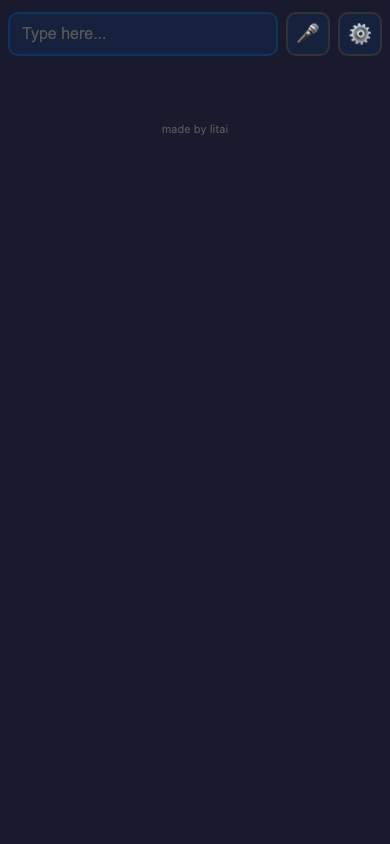
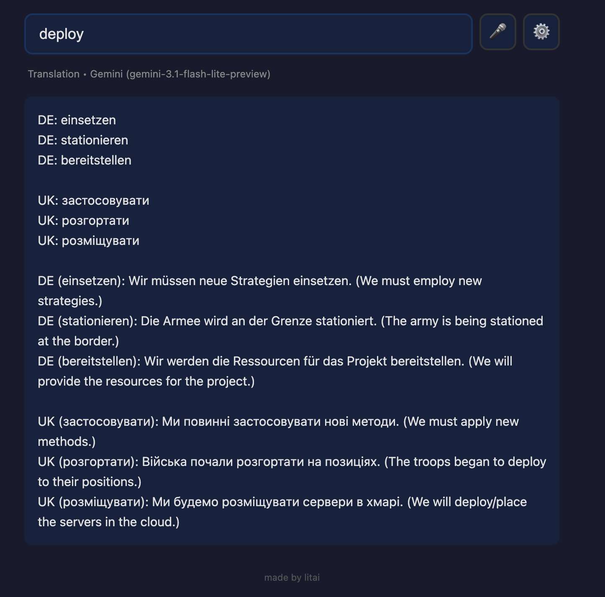
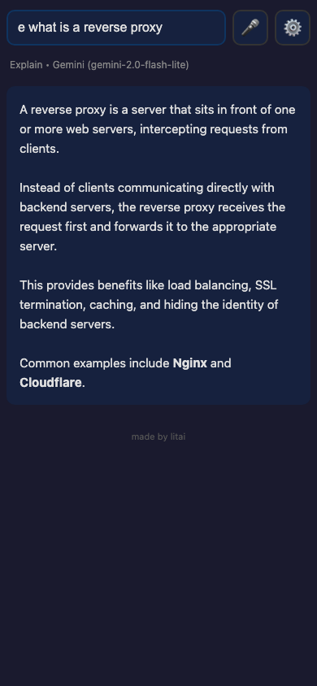
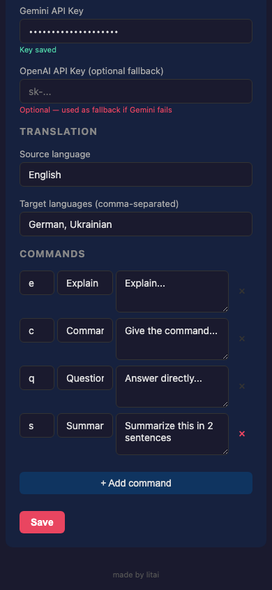
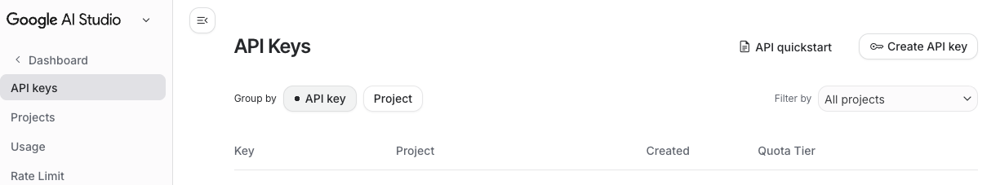
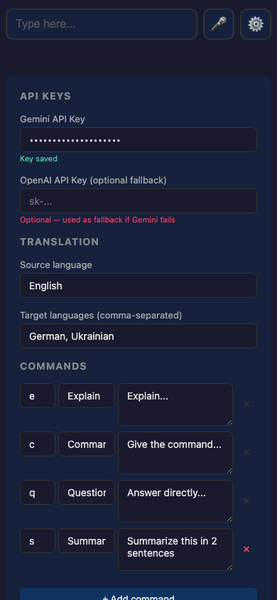

# Trivi — Your Side-Brain for Trivial Tasks

---

## The Problem

You're deep in a conversation with ChatGPT, debugging code, or reading an article. You hit an unfamiliar word. A term you half-know. A bash command you can't quite remember.

What do you do?

- Open a new browser tab → go to Google Translate → type the word → get the answer → switch back. Friction. Context switching.
- Ask your AI chat → it answers in 3 paragraphs → now you have to scroll past it to find where you were. Thread polluted.
- Or — and this is what most of us actually do — **you skip it.** You move on. You tell yourself you'll look it up later. You won't.

Every skipped word is a small hole in your understanding. One is fine. Ten in an article? You're reading the surface.

I built Trivi because I was tired of skipping.

---

## What Trivi Is

Trivi is a tiny app that lives on your phone or desktop — always one tap away. You type a word, a question, or a command prefix, hit Enter, and get an instant answer. Then you go back to what you were doing.

No chat threads. No scrolling. No context switching. No accounts.

**It does four things:**

### Translate

Just type any word or phrase. Trivi translates it to **all your languages at once.**

This was my original motivation. I'm bilingual — Ukrainian and German — and when I hit a tricky English expression, I need it in both languages to really get it. I used to type "translate to de and ukr" into my AI chat every single time. Now it's automated: type the word, hit Enter, get both translations instantly. You configure your target languages once in Settings, and every lookup just works.

No prefix needed — translation is the default mode. Type "deploy", get German and Ukrainian side by side in half a second.

### Explain

Type **e** + your question. Get a clear 3-6 sentence explanation. Not a lecture — just enough to understand and move on.

`e what is a reverse proxy`

### Command

Type **c** + what you need. Get the bash or Python command. Nothing else. Copy it and go.

`c find all files larger than 100mb`

### Question

Type **q** + anything. Get a direct answer. No preamble, no hedging.

`q capital of Uzbekistan`

---

## Why It Works

The magic isn't the AI. The AI is the same Gemini or ChatGPT you already use.

The magic is **friction removal.**

Opening a translator takes 5-8 seconds of context switching. That's enough for your brain to decide "not worth it." Trivi takes under 1 second — tap the app, type, Enter, done. That tiny difference changes behavior: you actually look things up instead of skipping them.

I noticed it in myself after a week: I was translating words I would have skipped before. My reading comprehension in English texts genuinely improved  because I stopped ignoring gaps.

---

## You Can Expand It

The four built-in modes are just the start. Open Settings and add your own command prefixes with custom prompts.

Some ideas:
- **s** → Summarize: "Summarize this in 2 sentences"
- **g** → Grammar: "Fix the grammar in this sentence, output only the corrected version"
- **d** → Define: "Give the dictionary definition, etymology, and one example sentence"
- **r** → Rewrite: "Rewrite this more concisely"

Your commands, your prompts, your shortcuts.

---

## Setup (5 Minutes, Once)

### 1. Get a Free Gemini API Key

1. Go to [aistudio.google.com](https://aistudio.google.com)
2. Sign in with any Google account
3. Click **"Get API Key"** in the left sidebar
4. Click **"Create API Key"**
5. Copy the key (starts with `AIza...`)

The free tier gives you ~15 requests per minute. More than enough.

### 2. Open Trivi

Go to: **[YOUR TRIVI URL]**

### 3. Enter Your Key

1. Tap the gear icon (Settings)
2. Paste your Gemini API Key
3. (Optional) Add an OpenAI key as fallback
4. Set your translation languages
5. Tap **Save**

### 4. Install as App (Recommended)

**On iPhone:** Safari → Share → "Add to Home Screen"
**On Android:** Chrome → Menu → "Add to Home Screen"
**On Mac/PC:** Chrome → address bar install icon

Now Trivi is one tap away. Always.

---

## How It Works (Under the Hood)

- **No accounts.** No sign-up. No data collection.
- **Your keys, your data.** API keys are stored in your browser only. They go directly to Google/OpenAI — never through our servers. There is no server.
- **Works offline** (app shell loads from cache; API calls need internet).
- **Cyrillic keyboard support.** Ukrainian `е` works as `e`, `с` as `c` — no keyboard switching needed.
- **20KB total.** The whole app is smaller than a single photo.
- **Open source.** [Source code on GitHub](https://github.com/litai-solutions/trivi-bot) — nothing hidden.

---

## Quick Reference

| Type this | Get this |
|-----------|----------|
| `hello` | Translation of "hello" |
| `e DNS` | Explanation of DNS |
| `c list docker containers` | The bash command |
| `q who painted starry night` | Direct answer |

---

*Built by [litai](https://github.com/litai-solutions) — we build AI tools that work correctly.*
